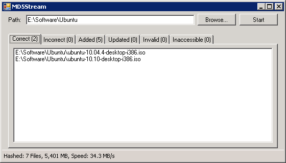

About MD5Stream:
================
Like many other MD5 checksum verification utilities, MD5Stream lets you find out if your files have been corrupted, however, unlike most programs, MD5Stream will store the MD5 hash of each file (together with its last modification time) in the file [alternate data stream](http://blogs.technet.com/b/askcore/archive/2013/03/24/alternate-data-streams-in-ntfs.aspx).  
Whenever you move your file, the hash will go with it, and you won't have to worry about keeping an updated hash list.  
Using the file last modification time, which is stored with the MD5 hash, the program can tell whether the file was modified or corrupted, and in the latter case the MD5 hash will simply be updated.  

##### What this program can do:
1. Calculate an MD5 hash and store it in an NTFS [ADS](http://blogs.technet.com/b/askcore/archive/2013/03/24/alternate-data-streams-in-ntfs.aspx).
2. Calculate hashes for all files in a given directory (including sub-directories).
3. Verify the stored hash, list corrupted files, and update the hash for any file that was legitimately modified.

Contact:
========
If you have any question, feel free to contact me.  
Tal Aloni <tal.aloni.il@gmail.com>
